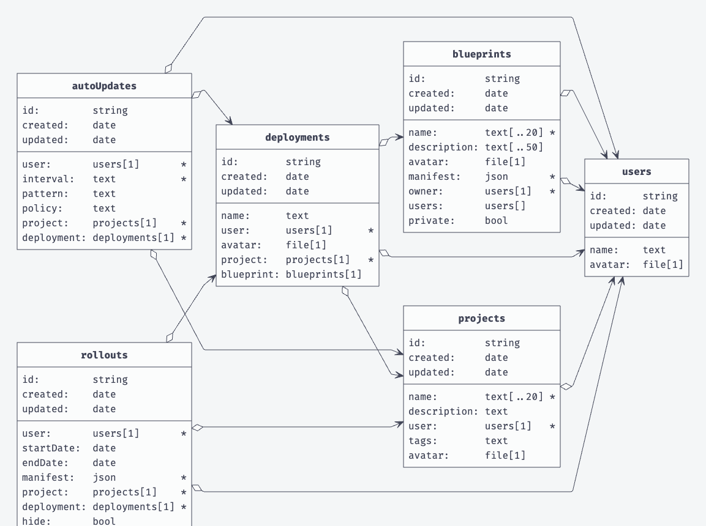

# 👖 Pocketbase

One-Click uses the open source backend [pocketbase](https://pocketbase.io) to achieve things like authentication and storing data. It also serves the frontend of One-Click. In the release process the pocketbase and frontend code will get compiled and put into a single container image and pushed to the Github container registry.

Pocketbase offers the ability to extend it with our own golang code. You can listen on certain events and then execute code. We use that to make the Kubernetes api calls and manage the Kubernetes resources created via the frontend interface.

You can find the code under the following link: [https://github.com/janlauber/one-click/tree/main/pocketbase](https://github.com/janlauber/one-click/tree/main/pocketbase)

### Authentication

Pocketbase uses JWT tokens for authentication. The frontend sends a request to the pocketbase backend with the user credentials. The backend then checks if the user exists and if the password is correct. If everything is correct, the backend will return a JWT token. The frontend will then store this token in the local storage and use it for every request to the backend.

We also support the ability to use the following authentication providers:

* Google
* Github
* Microsoft

The frontend will automatically display the login buttons for these providers if they are enabled in the pocketbase backend.

<figure><figcaption>
pocketbase settings
</figcaption></figure>

### Database UML

Generated with the [PocketBaseUML](https://pocketbase-uml.github.io) tool.

<figure><figcaption>
UML
</figcaption></figure>

### Endpoints

Pocketbase allows you to create custom endpoints. These endpoints can be used to execute custom code. We use this feature to serve everything to the frontend. The custom endpoints are written in golang and you can find them in the `main.go` file under the `app.OnBeforeServe().Add(func(e *core.ServeEvent) error {` function.


[openapi.yaml](../.gitbook/assets/openapi.yaml)



[openapi.yaml](../.gitbook/assets/openapi.yaml)



[openapi.yaml](../.gitbook/assets/openapi.yaml)



[openapi.yaml](../.gitbook/assets/openapi.yaml)



[openapi.yaml](../.gitbook/assets/openapi.yaml)



[openapi.yaml](../.gitbook/assets/openapi.yaml)



[openapi.yaml](../.gitbook/assets/openapi.yaml)



[openapi.yaml](../.gitbook/assets/openapi.yaml)



[openapi.yaml](../.gitbook/assets/openapi.yaml)



[openapi.yaml](../.gitbook/assets/openapi.yaml)



[openapi.yaml](../.gitbook/assets/openapi.yaml)



[openapi.yaml](../.gitbook/assets/openapi.yaml)


#### Table

| Endpoint                                  | Method   | Description                                    |
| ----------------------------------------- | -------- | ---------------------------------------------- |
| `/`                                       | `*`      | Serves the frontend                            |
| `/api`                                    | `*`      | Serves the backend                             |
| `/_`                                      | `*`      | Serves the backend                             |
| `/rollouts/:projectId/:rolloutId/status`  | `GET`    | Get rollout status                             |
| `/rollouts/:projectId/:rolloutId/metrics` | `GET`    | Get rollout metrics                            |
| `/rollouts/:projectId/:rolloutId/events`  | `GET`    | Get rollout events                             |
| `/rollouts/:projectId/:podName/logs`      | `GET`    | Get pod logs                                   |
| `/pb/blueprints/:blueprintId`             | `GET`    | Get blueprint                                  |
| `/pb/blueprints/shared/:blueprintId`      | `POST`   | Share blueprint                                |
| `/auto-update/:autoUpdateId`              | `POST`   | Auto update                                    |
| `/cluster-info`                           | `GET`    | Get cluster info                               |
| `/rollouts/:projectId/:podName`           | `DELETE` | Delete pod                                     |
| `/ws/k8s/rollouts`                        | `GET`    | Websocket to get resource updates of a rollout |
| `/ws/k8s/logs`                            | `GET`    | Websocket to get pod logs                      |
| `/ws/k8s/events`                          | `GET`    | Websocket to get pod events                    |

All endpoints are protected by the JWT authentication, except the websocket endpoints. The frontend will send the JWT token in the header of the request.

### Environment Variables

| Variable Name | Default       | Description                                                                                                                        |
| ------------- | ------------- | ---------------------------------------------------------------------------------------------------------------------------------- |
| `LOCAL`       | `false`       | Set to `true` if you're running KubeLab locally. It will take your local kubeconfig under **.kube/config**                         |
| `CronTick`    | `*/1 * * * *` | The tick in cron notation at which the auto image update will check for new updates in the registry. Do not change this under 1min |

### Extended Information

For more information about pocketbase, please visit the [official documentation](https://pocketbase.io/docs). Also dig into the source code of our implementations and try to understand how we use pocketbase in our project.
